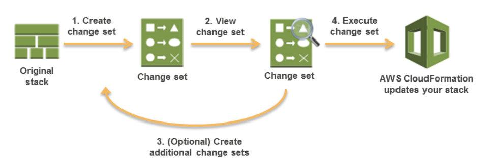

# Pseudo Parameters

Parameters that are predefined by CloudFormation, and are provided to the stack resources during runtime.

List of Pseudo parameters that are applied by CloudFormation, when referenced in templates:
---
### AWS::AccountId
---
Returns the AWS account ID of the account in which the stack is being created.

### AWS::NotificationARNs
---

Returns the list of notification Amazon Resource Names (ARNs) for the current stack.

### AWS::NoValue
---
Removes the corresponding resource property when specified as a return value in the Fn::If intrinsic function. 

```yaml
MyDB:
  Type: AWS::RDS::DBInstance
  Properties:
    AllocatedStorage: '5'
    DBInstanceClass: db.m1.small
    Engine: MySQL
    EngineVersion: '5.5'
    DBSnapshotIdentifier:
      Fn::If:
      - UseDBSnapshot
      - Ref: DBSnapshotName
      - Ref: AWS::NoValue

```
### AWS::Partition
---
Returns the partition that the resource is in.

The following are the supported partitions:
- aws : AWS Regions
- aws-cn : AWS China Regions
- aws-us-gov : AWS GovCloud (US) Regions

### AWS::Region
---
Returns a string representing the AWS Region in which the encompassing resource is being created.

### AWS::StackId
---
Returns the ID of the stack as specified with the aws cloudformation create-stack command -- stack arn

### AWS::StackName
---
Returns the name of the stack


### AWS::URLSuffix
---

Returns the suffix for a domain. The suffix is typically amazonaws.com, but might differ by region. For example, the suffix for the China (Beijing) region is amazonaws.com.cn. 


## Examples

- ARN generation
```
Format - arn:partition:service:region:account-id:resource-id
Example - arn:aws:events:us-east-1:479963538995:rule/ExampleRule
```

```yaml
Outputs:
  RoleArn:
    Value: !Sub arn:${AWS::Partition}:events:${AWS::AccountId}:rule/ExampleRule
```

- Service endpoints generation

```
Format : protocol://service-code.region-code.amazonaws.com
Example : https://sqs.us-east-1.amazonaws.com
```

```yaml
Outputs:
  QueueServiceEndpoint:
    Value: !Join
              - ''
              - - 'https://'
                - 'sqs.'
                - !Ref 'AWS::Region'
                - '.'
                - !Ref 'AWS::URLSuffix'
```

# Conditions and Conditional Resource Creation

You can use intrinsic functions, such as Fn::If, Fn::Equals, and Fn::Not, to conditionally create stack resources. These conditions are evaluated based on input parameters that you declare when you create or update a stack. 

### Fn::And
---
```
MyAndCondition: !And
  - !Equals ["sg-mysggroup", !Ref "ASecurityGroup"]
  - !Condition SomeOtherCondition
```

### Fn::Equals
---

```
UseProdCondition:
  !Equals [!Ref EnvironmentType, prod]
```
### Fn::If
---

```
SecurityGroups:
  - !If [CreateNewSecurityGroup, !Ref NewSecurityGroup, !Ref ExistingSecurityGroup]
```
### Fn::Not
---

```
MyNotCondition:
  !Not [!Equals [!Ref EnvironmentType, prod]]
```
### Fn::Or
---

```
MyOrCondition:
  !Or [!Equals [sg-mysggroup, !Ref ASecurityGroup], Condition: SomeOtherCondition]
```

Example :

```yaml
AWSTemplateFormatVersion: 2010-09-09

Conditions:
  createRoleEast1: !Equals [!Ref "AWS::Region", "us-east-1"]

Resources:
  RootRoleEast1:
    Condition: createRoleEast1
    Type: 'AWS::IAM::Role'
    Properties:
      RoleName: !Sub test-role-${AWS::Region}
      AssumeRolePolicyDocument:
        Version: 2012-10-17
        Statement:
          - Effect: Allow
            Principal:
              Service:
              - ec2.amazonaws.com
            Action:
              - 'sts:AssumeRole'
```

# Change Sets

- Change Set Overview



### Actions
- Create Change Set
- View Change Set
- Execute Change Set
- Delete Change Set

# CloudFormation APIs

- CreateStack
- UpdateStack
- DeleteStack
- DescribeStacks
- DescribeStackResource
- DescribeStackResources
- CreateChangeSet
- DescribeChangeSet
- ExecuteChangeSet
- DeleteChangeSet

## Task 
- Create two stacks using a single template with an EC2 instance resource in a public subnet, which has dynamic parameters which you can pass during runtime.

- Use an "Environment" parameter, which has allowed values [qa, prod, dev, test]

- Use mappings to define RegionMap top level key for us-east-1 and us-west-1 regions

- if the environment is dev, stack should be created in us-east-1 region, with an AMI available in that region and instance type should be t2.small.

- if the environment is prod, stack should be created in us-west-1 region, with an AMI available in that region and instance type should be t2.large.

- if the environment is qa or uat, the stack should skip resource creation.

- Use conditions to separate resource creation for different regions, with imageId and instance type properties based on the conditions and mappings given above.
 
- Output the public IP of the instances. 

- Output the service endpoints for the region, in which the stack is deployed.

Once you have successfully created a template, paste the template snippet in the below given link and share it with us :

### https://code.amazon.com/

